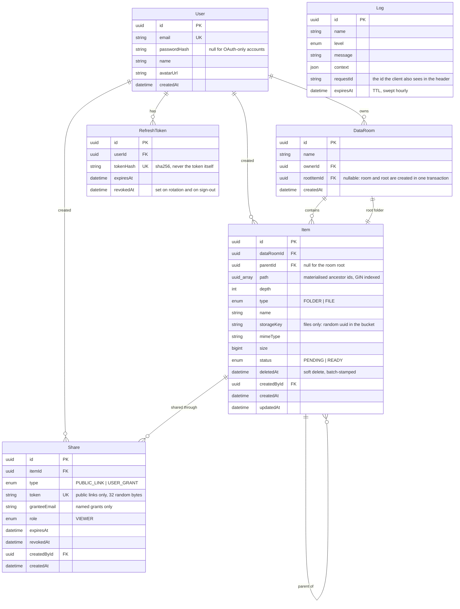

# Data Room

https://data-room-web-beige.vercel.app/
https://dataroom-eu0k.onrender.com/docs

A virtual data room: folders, PDF files, and sharing — by public link or by
email. Built as a take-home assignment.

- **Backend** — NestJS 11, Prisma 7, PostgreSQL, Supabase Storage
- **Frontend** — React 19, Vite, TanStack Router + Query, Tailwind 4, Base UI
- **Monorepo** — npm workspaces: `apps/api`, `apps/web`

---

## Setup

### Prerequisites

- Node.js 20+
- PostgreSQL 14+ (local, or a Supabase project — see below)
- A Supabase project for file storage (a free one is enough)

### 1. Install

```bash
npm ci
```

One lockfile in the repository root covers both workspaces. Run this from the
root — `npm ci` inside `apps/api` or `apps/web` will fail, there is no
lockfile there.

### 2. Backend

Copy `apps/api/.env.example` to `apps/api/.env` and fill it in:

| Variable | What it is |
| --- | --- |
| `DATABASE_URL` | Postgres connection string |
| `SUPABASE_URL` | `https://<project>.supabase.co` |
| `SUPABASE_SECRET_KEY` | Project Settings → API keys → secret |
| `SUPABASE_BUCKET` | Bucket name, e.g. `dataroom-files` |
| `JWT_ACCESS_SECRET` | Any random string, unique per environment |
| `JWT_REFRESH_SECRET` | Another one |
| `WEB_ORIGIN` | `http://localhost:5173` locally |

Generate the secrets with:

```bash
node -e "console.log(require('crypto').randomBytes(32).toString('base64url'))"
```

In Supabase Storage, create a **private** bucket named after
`SUPABASE_BUCKET`, with a 50 MB file size limit and `application/pdf` as the
allowed MIME type.

Apply the migrations:

```bash
cd apps/api && npx prisma migrate deploy
```

Start it:

```bash
npm run dev:api
```

The API listens on http://localhost:3000, Swagger lives at
http://localhost:3000/docs.

### 3. Frontend

Copy `apps/web/.env.example` to `apps/web/.env.local` — the default
`VITE_API_URL=http://localhost:3000` already matches the backend above.

```bash
npm run dev:web
```

The app opens at http://localhost:5173. The port is pinned: if 5173 is busy
Vite fails instead of quietly moving elsewhere, so the browser can never talk
to a stale server.

### Useful commands

```bash
cd apps/web && npm run typecheck   # tsc -b
cd apps/web && npm run lint        # oxlint + layer boundary check
cd apps/web && npm run storybook   # Storybook on :6006
cd apps/web && npm run api:types   # regenerate API types from Swagger
cd apps/api && npm run build       # prisma generate && nest build
```

`npm run api:types` needs the API running: it reads `/docs-json`.

Deployment (Render + Vercel + Supabase) is documented separately in
[docs/DEPLOY.md](docs/DEPLOY.md).

---

## Design decisions

### Materialised path instead of a recursive tree

`Item.path` stores the array of ancestor ids from the root down, plus a
`depth` counter. This one decision is what makes the rest of the system
simple:

- **Breadcrumbs** are one query: `WHERE id IN (path)`. Walking up by
  `parentId` would cost one query per nesting level.
- **Subtree statistics** are one indexed query — see "How it scales" below.
- **Inherited sharing** is a lookup over `[item.id, ...item.path]`: share a
  folder and everything inside it opens through the very same check, with no
  recursion anywhere.

The price is that a move has to rewrite the path prefix of every descendant.
That happens in a single `UPDATE` inside a transaction, and moves are far
rarer than reads.

### One access check, not a permission system

`AccessGuard` + `AccessService` are the only place that answers "allowed or
not". Owners pass immediately; everybody else passes if a live `Share` exists
on the item or on any of its ancestors. A public link and a named grant are
two rows of the same `Share` table, distinguished by `type` — a public link
carries a token and no addressee, a grant is the other way round, and a CHECK
constraint refuses any row that is both.

Refusals are always **404, never 403**. The difference between "no
permission" and "does not exist" is itself information about someone else's
room: with 403 you could enumerate which documents exist inside it.

### The public viewer uses the same endpoints

There are no `/public/*` routes. A request carries either a `Bearer` token or
an `X-Share-Token` header, and the guard reduces both to a single check. The
frontend follows the same shape: `FolderView` serves the owner, the grantee
and the link visitor, with `readOnly` deciding which actions exist in the
tree at all — they are absent, not hidden with CSS.

### Three-step upload, bytes never touch the API

1. `POST /items/upload-url` creates a `PENDING` row and returns a signed URL.
2. The browser `PUT`s the bytes straight into Supabase Storage.
3. `POST /items/:id/confirm` checks the object and flips the row to `READY`.

The API never buffers file bytes, so it does not care about request body
limits or slow clients. The `PENDING` row reserves the name inside the folder
while staying out of listings.

Step 3 is where "PDFs only" is actually enforced: it reads the first bytes of
the stored object and compares them to `%PDF-`. Checking the reported MIME
type would prove nothing — Supabase takes it from the `Content-Type` header
the client itself sent.

### Soft delete with batch restore

Deleting stamps `deletedAt` across the node and its whole subtree in one
statement. Restore lifts exactly the rows whose `deletedAt` equals that
timestamp — so a child deleted separately earlier stays in the trash instead
of silently coming back. The timestamp is truncated to milliseconds because
Postgres `now()` has microsecond precision while a JS `Date` does not, and
without truncation the read-back value would never equal the stored one.

### Name conflicts are resolved, not rejected

Uploading `report.pdf` into a folder that already has one produces
`report (1).pdf`, and the UI says so in a toast. A partial unique index on
`lower(name)` — live rows only — is the actual guarantee; the application
level exists to make the common case pleasant rather than to enforce it.

### Frontend structure

Bulletproof-react layering, enforced by
`apps/web/scripts/check-boundaries.mjs` in `npm run lint`: the shared layer
knows nothing about features, features know nothing about the app layer, and
features know nothing about each other. Composition of two features happens
in a route file — which is why `PublicFolder` lives in the app layer.

Upload, viewer, search and trash live *inside* `features/items` rather than
as separate features: they do not exist without items and share the same
cache keys, so splitting them out would create exactly the cross-feature
imports the boundary check forbids.

### Trade-offs taken knowingly

- **Search is owner-only.** A grantee cannot search inside a folder shared
  with them. Scoping search to a share would mean a second, path-bounded
  query; it was out of scope for the MVP.
- **Swagger describes requests, not responses.** Controllers return plain TS
  interfaces, so Nest has nothing to build response schemas from. Generated
  frontend types therefore protect request bodies only; response shapes in
  `apps/web/src/types/api.ts` are written by hand.
- **A failed upload that is retried creates a second row.** The retry starts
  from step 1, so the abandoned `PENDING` row keeps the name until the hourly
  cleanup removes it, and the retried file lands as `name (1).pdf`.
- **`npm audit` reports 3 high findings** in `deepmerge-ts`, pulled in by the
  Prisma CLI (a devDependency). We are on the latest version; no fix exists
  upstream, and `audit fix --force` would downgrade Prisma across a major.

---

## Data model



Indexes that matter:

| Index | Serves |
| --- | --- |
| `Item(dataRoomId, parentId, deletedAt)` | folder listings |
| `Item(dataRoomId, name)` | search and name-conflict resolution |
| `Item(path)` GIN | subtree statistics, inherited access |
| `Item(parentId, lower(name))` partial unique | one live name per folder |
| `Share(itemId)`, `Share(granteeEmail)` | access checks, "shared with me" |

---

## How it scales

### Total size and item count of a folder, including the whole subtree

One indexed query, no recursion:

```sql
SELECT
  count(*) FILTER (WHERE "type" = 'FOLDER') AS folders,
  count(*) FILTER (WHERE "type" = 'FILE')   AS files,
  coalesce(sum("size"), 0)                  AS bytes
FROM "Item"
WHERE "dataRoomId" = $1::uuid
  AND $2::uuid = ANY("path")
  AND "deletedAt" IS NULL
  AND "status" = 'READY';
```

`$2 = ANY(path)` is exactly what the GIN index on `path` answers, so the cost
grows with the size of the subtree being measured rather than with the size
of the room. The node itself is excluded — the delete dialog is about what is
inside it. It is computed on demand, only while that dialog is open
(`useSubtreeStats`), which is why nothing has to be denormalised or kept in
sync.

If this ever became hot — a size column shown on every folder row, say — the
next step would be a counter cache on `Item` updated by trigger, or a
periodic rollup. Neither is needed at the scale this is built for, and both
would introduce a consistency problem that does not exist today.

### What changes at 100,000 files in one room

**Listing.** Unchanged in shape. Listings are always scoped to one folder
(`parentId`), so the query touches the children of that folder, not the room.
The composite index `(dataRoomId, parentId, deletedAt)` covers it. A room
with 100k files spread over folders lists exactly as fast as a small one.

**Pagination.** Already keyset, not offset. The cursor encodes
`(type, name, id)` and the next page asks for "strictly after this row", so
page 500 costs the same as page 1 — unlike `OFFSET`, which has to walk and
discard everything before it. The extra row fetched per page is what reports
`nextCursor`, so there is no `COUNT(*)` anywhere. Sort direction is
deliberately fixed: the cursor predicate is built one way only, and a
parameter flipping it would silently break paging rather than extend it.

The one case that does degrade is a single folder holding 100k children:
scrolling to the end still means 2,000 requests of 50. That is a UI problem
(virtualised rows, jump-to-letter), not a query problem.

**Indexes.** The listing and access paths are already covered. The one that
would need attention is **search**: `name contains q` compiles to
`ILIKE '%q%'`, which no B-tree can serve, so it degrades into a scan bounded
by the room. At 100k rows that is noticeable. The fix does not touch schema
design or service code — add a trigram index and the same query starts using
it:

```sql
CREATE EXTENSION IF NOT EXISTS pg_trgm;
CREATE INDEX item_name_trgm ON "Item" USING gin (name gin_trgm_ops);
```

For full-text search over document *contents* rather than names, the shape
would change: a `tsvector` column fed by a background extraction job, since
the API never sees file bytes.

**Storage and cost.** Files live in object storage keyed by random uuid, so
the database grows by one row per file, not by bytes. Deleting a room
collects the storage keys before the cascade removes the rows — otherwise the
objects would become unreachable forever.

### Extending sharing to per-user roles (viewer / editor)

The model already accounts for this, which is why no remodelling is needed:

1. `Share.role` **exists today** as an enum with a single value, `VIEWER`.
   Adding `EDITOR` is one migration on that enum.
2. `AccessResult.role` is already the thing every guard decides on, and
   `@RequireRole('OWNER' | 'VIEWER')` already annotates every route. The
   ordering check inside `AccessGuard` grows one rung:
   `OWNER > EDITOR > VIEWER`.
3. `AccessService.resolve` already returns the matched `Share`. Instead of
   hardcoding `role: 'VIEWER'` for non-owners it would return `share.role`.
4. Mutation routes currently marked `@RequireRole('OWNER')` split into two
   groups: content edits (create folder, rename, move, upload, delete) drop
   to `EDITOR`, while ownership operations (creating shares, revoking access,
   deleting the room, the trash) stay `OWNER`.

The frontend needs the same one-line shift: `readOnly` becomes
`role === 'VIEWER'`, and `FolderView` already gates every action on it.

Two things genuinely worth deciding at that point, neither of them structural:

- **Inheritance conflicts.** With one role per share the highest match wins;
  the current query takes the first live share up the chain. With two roles
  it should take the *strongest* — an `ORDER BY` on the role enum.
- **Attribution.** `Item.createdById` already records who uploaded what, so
  "edited by" is available without new columns.

---

## Where AI was used

The whole project was built with Claude (Claude Code) as a pair, over a
sequence of sessions. Concretely:

**Planning.** A specification and a 22-task implementation plan were written
with AI before any code, which is what kept the ordering sane: the whole
backend was finished and checkable through Swagger before any frontend
existed. Those planning documents were working artifacts and are not part of
this repository.

**Implementation.** Most code was written by AI against that plan, one task at
a time, with a human review checkpoint after each. The workflow was
deliberately not "generate and hope": every task ended with a real check in
the browser and a clean console before the next one started.
